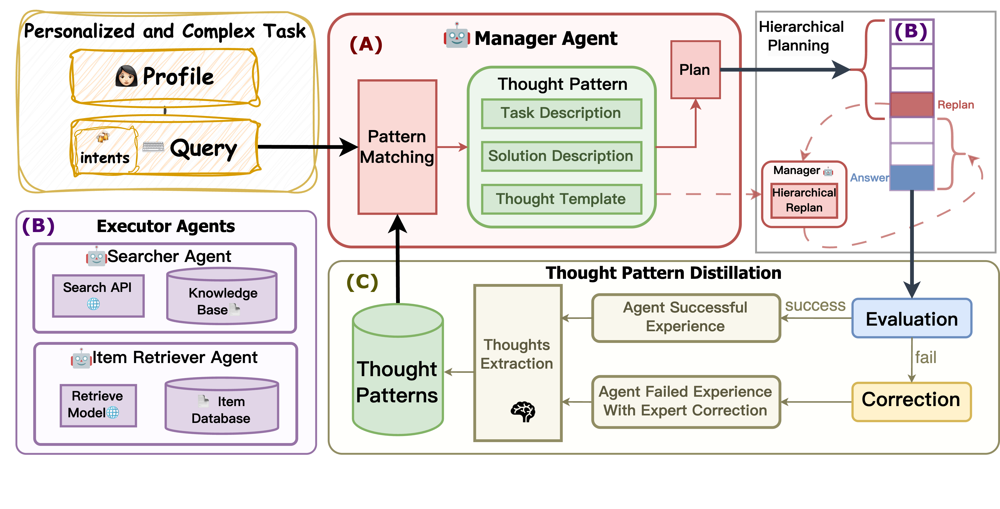

# TAIRA: Thought-Augmented Planning for LLM-Powered Interactive Recommender Agent

[](https://opensource.org/licenses/MIT)
[](https://www.python.org/)

**Thought-Augmented Planning for LLM-Powered Interactive Recommender Agent** *Proceedings of the 32nd ACM SIGKDD Conference on Knowledge Discovery and Data Mining (KDD '26)*

Haocheng Yu, Yaxiong Wu, Hao Wang, Wei Guo, Yong Liu, Yawen Li, Yuyang Ye, Junping Du, and Enhong Chen.

---

## 📖 Introduction

Interactive recommender systems (IRS) allow users to express needs via natural language. However, existing LLM-powered agents often struggle with **complex, unrefined, or ambiguous user intents** due to limited planning and generalization capabilities.

We propose **TAIRA** (Thought-Augmented Interactive Recommender Agent), a novel multi-agent system designed to handle complex user intents through:
1.  **Thought Pattern Distillation (TPD):** A mechanism that distills high-level reasoning patterns from both successful agent trajectories and expert-corrected failures.
2.  **Hierarchical Planning:** A manager agent orchestrates tasks by decomposing user needs and dynamically updating plans based on execution feedback.
3.  **Generalization:** Leveraging distilled thought patterns to solve novel tasks effectively.

<p align="center">
  
  <br>
  <em>Figure 1: Examples of recommendation involving diverse and complex user intent and thought-augmentation with past experiences.</em>
</p>

## 🚀 Framework Architecture

TAIRA operates as a multi-agent system featuring a **Manager Agent** that orchestrates specialized **Executor Agents** (Searcher, Item Retriever, etc.). The system continuously learns and refines its planning capabilities through the **Thought Pattern Distillation** module.

<p align="center">
  
  <br>
  <em>Figure 2: The overall architecture of TAIRA, illustrating the Manager Agent's planning process, Executor Agents, and the TPD mechanism.</em>
</p>

## 🛠️ Installation

### Prerequisites
* Python 3.12.7 or higher
* PyTorch (Check [official site](https://pytorch.org/get-started/locally/) for your CUDA version)

### Setup
1.  Clone the repository:
    ```bash
    git clone [https://github.com/Alcein/TAIRA.git](https://github.com/Alcein/TAIRA.git)
    cd TAIRA
    ```

2.  Install dependencies:
    ```bash
    pip install -r requirements.txt
    ```

## ⚙️ Configuration (`system_config.yaml`)

Before running the program, you need to configure the `system_config.yaml` file based on your specific requirements.


### Explanation of the Parameters:
- `QUERY_NUMBER`: Limits the size of the dataset. Here, it's set to `500`, meaning it will process up to 200 data points.
- `TOPN_ITEMS`: Number of top items returned, set to `500`.
- `TOPK_ITEMS`: The number of top K items selected, set to `10`.
- `DOMAIN`: The data domain being used. Options include `"amazon_clothing"`, `"amazon_beauty"`, and `"amazon_music"`. The default is set to `"amazon_clothing"`.
- `MODEL`: Specifies the model to be used. The default model is `"gpt-4o"`, but you can switch to other models.
- `METHOD`: The method being used. In this case, it's set to `TAIRA`.
- `OPENAI_BASE_URL` and `OPENAI_API_KEY`: These fields are for configuring access to the OpenAI API. Make sure to provide your valid OpenAI API key. If you need to use a model other than openai, please set the corresponding base_url and api_key.
- `GOOGLE_API_KEY` and `GOOGLE_CSE_ID`: These are for Google API configurations in Searcher Agent.

Ensure you have a valid OpenAI API key set up in the `OPENAI_API_KEY` field for the program to work properly.
## 🏃 Usage

To start the interactive recommendation simulation and evaluation:

```bash
python main.py
```

